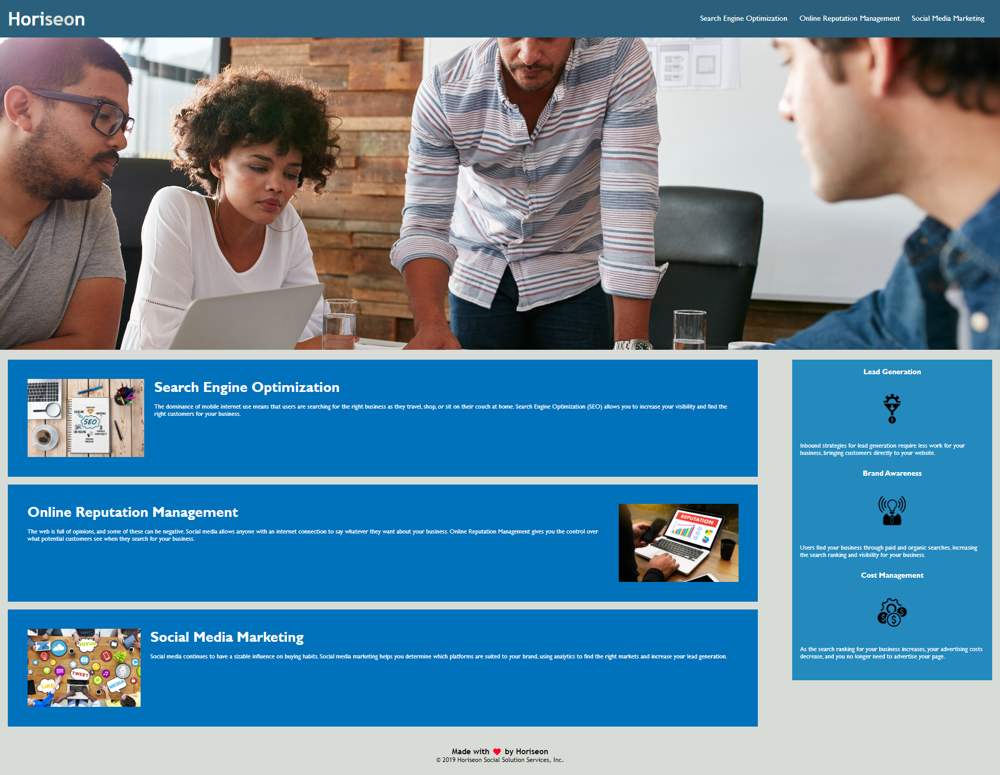

# Horiseon Module 1 Challenge

Horiseon is a digital marketing and search engine optimization company to benefit companies to promote their business. 
This module challenge demonstrates my ability to refactor code with a main focus on accessibility. 

## Installation
N/A

## Links 
- [Repo](https://github.com/marissa-a-darr/marissadarr_module1)

- [URL](https://github.com/marissa-a-darr/marissadarr_module1.git)

## Screenshot 

## Built With
-HTML
-CSS

**Marissa Darr**
-Phone: 860-671-7813
-Email: mrsaanagmail.com

# marissadarr_module1
